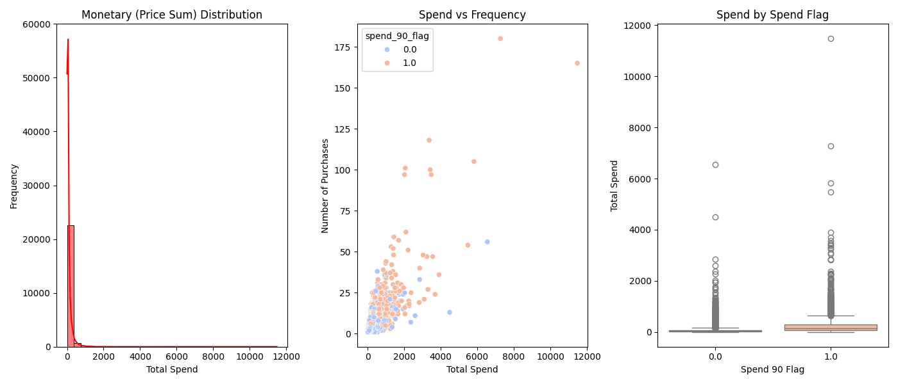
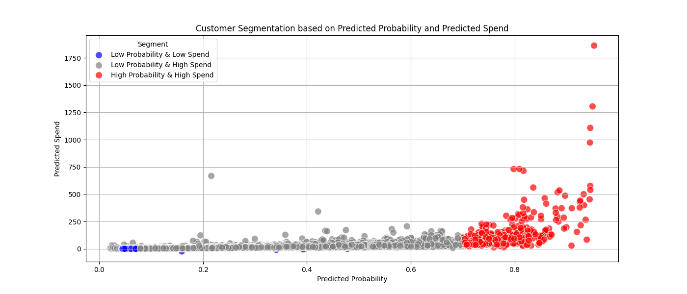
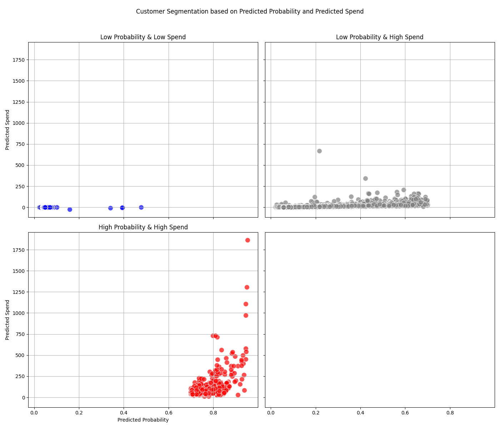
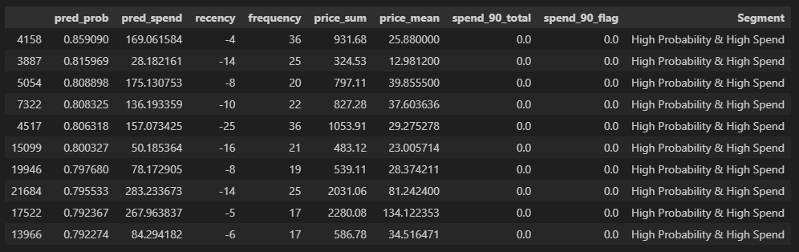

# Customer Lifetime Value & RFM Analysis using Machine Learning

[CDNow Wikipedia](https://en.wikipedia.org/wiki/CDNow)

CDnow, Inc. was a dot-com company that operated an online shopping website selling compact discs and music-related products. In April 1998, during the dot-com bubble, the company was valued at over $1 billion ($1.74 billion in 2023). In July 2000, it was acquired by Bertelsmann Music Group for $117 million ($197 million in 2023); shortly thereafter Amazon was contracted to operate the website. At its peak, it employed over 750 people and had offices in Fort Washington, Pennsylvania, New York City, London, and Los Angeles.

In 2013 CDNow was completely taken offline.

[CDNow dataset](https://www.kaggle.com/datasets/woody123/cdnow-dataset)

[Customer LTV Notebook](src/notebooks/customer_ltv.ipynb)

<!-- trunk-ignore(markdownlint/MD025) -->
# Comprehensive Strategic Recommendations Report

## Executive Overview

### Priority Concern

1. This report analyzes customer patterns from Q1 1997 through June 1998. All customers were acquired in the first quarter of 1997 and no additional customers through June of 1998. Customer acquisition should be a top priority. The Recommended Strategies presented only address our current customer base due to the limitations of the given data. An additional analysis is needed for customer acquisition.

1. From our current customer base, only 3301 customers purchased in the last 90 days out of 23570. That is 14.01%.

### Recommended Strategies

### 1. Customer Engagement and Retention Strategies

High-Value Customers:

* **Loyalty Programs:** Develop and enhance loyalty programs to reward high-value and high-frequency customers. Offer exclusive deals, early access to new products, and personalized communications to maintain their engagement and satisfaction.
* **Personalized Offers:** Implement personalized marketing strategies for high-value customers, ensuring they receive tailored promotions based on their preferences and past purchase behavior.

Low-Engagement Customers:

* **Reactivation Campaigns:** For customers with a high historical spend but low recent engagement, create targeted reactivation campaigns. Utilize personalized discounts, special promotions, and reminder emails to encourage these customers to return.
Cost-Effective Strategies: For low-spend and low-probability customers, use cost-effective re-engagement strategies like email marketing and social media campaigns to improve engagement without significant investment.

Feedback and Personalization:

* **Customer Feedback:** Solicit feedback from both high-frequency and low-frequency customers to understand their preferences and barriers to purchase. Use this information to tailor marketing efforts and improve customer satisfaction.
* **Continuous Monitoring:** Regularly analyze customer behavior and segmentation data to identify shifts and trends. Adjust marketing strategies in real-time to address any emerging patterns promptly.

### 2. Purchase Frequency and Spend Strategies

High-Frequency Customers:

* **Upsell and Cross-Sell:** Utilize upselling and cross-selling opportunities for high-frequency and high-spend customers. Personalized recommendations based on their purchase history can increase their average order value.
* **Retention Focus:** Ensure the satisfaction and continued engagement of high-frequency customers through VIP services, personalized experiences, and loyalty rewards.

Low-Frequency Customers:

* **Re-Engagement Strategies:** Develop targeted campaigns to increase the purchase frequency of low-frequency customers. Offer incentives like personalized discounts, special promotions, and reminders of new products to encourage more frequent purchases.

Segment-Based Campaigns:

* **Customer Segmentation:** Use insights from the spend and frequency analysis to segment customers and tailor marketing strategies accordingly. High-frequency, high-spend customers should receive different incentives compared to low-frequency, low-spend customers.

### 3. Monetary Value and Spend Strategies

Low-Value Customers:

Improving Engagement: For low-spend customers, target them with special promotions, personalized offers, and new product announcements to increase their engagement and spending.
Understanding Barriers: Conduct surveys or feedback mechanisms to understand why some customers have low spend despite previous engagement. Address these barriers to improve their purchasing behavior.

High-Value Dormant Customers:

* **Targeted Re-Engagement:** Focus on re-engaging high-value customers who have not made recent purchases. Personalized re-engagement strategies such as tailored discounts, loyalty rewards, and exclusive offers can motivate them to make a purchase.
* **Customer Satisfaction:** Implement feedback mechanisms to understand the reasons for their low engagement. Use this feedback to refine re-engagement strategies and address any issues that may be preventing them from making a purchase.

### 4. Segment-Specific Marketing and Incentives

Low Probability & Low Spend Customers:

* **Low-Cost Re-Engagement:** Use low-cost re-engagement strategies such as personalized emails, special promotions, and social media interactions to encourage spending.

Low Probability & High Spend Customers:

* **High-Value Re-Engagement:** Develop targeted re-engagement strategies for high-value dormant customers, including personalized discounts, loyalty rewards, and exclusive offers.

High Probability & High Spend Customers:

* **Retention and Upsell:** Focus on retention strategies for highly engaged and valuable customers through loyalty programs, personalized experiences, and upsell/cross-sell opportunities.

Incentive Programs:

* **Reward Repeat Purchases:** Implement incentive programs for low-engagement customers to increase their purchase probability. Offer time-limited discounts, referral bonuses, and rewards for repeat purchases.

---

## Report Detail

### Recency Segmentation

#### Recency Distribution

* **High Recent Activity:** There are notable peaks around 0 to -50 days, indicating a large number of customers have made recent purchases. This suggests current promotional campaigns or product offerings are effectively engaging customers.
* **Loyal Customers:** The significant number of purchases made in the very recent past (around 0 days) indicates that a portion of the customer base is highly engaged and possibly loyal.
* **Potential Lapsed Customers:** The lower frequency of purchases around -200 to -300 days suggests there may be a segment of customers who have not engaged with the business for a while. This could be a target for re-engagement campaigns.

#### Recency vs Spend

* **Higher Spend with Recency:** This confirms that recent customer engagement is a strong predictor of higher spending. Maintaining consistent and relevant communication with customers is crucial to keeping them engaged and driving higher spending.
* **Engaged High Spenders:** The orange points (Recent spenders) clustered near the recent dates (0 days) highlight a segment of high-value customers who have been actively purchasing recently.
* **Retention Opportunity:** Customers with older purchase dates and lower spending might represent an opportunity for retention and up-selling. Strategies such as targeted marketing or personalized offers could help re-engage these customers.

#### Recency by Spend Flag

* **Targeting Non-Recent Customers:** Customers with a spend_90_flag of 0.0, who have not spent recently, present an opportunity for targeted re-engagement strategies. Identifying the reasons for their reduced activity (e.g., product preferences, past purchase issues) could inform personalized approaches to bring them back.

* **Average Non-Recent Customers Days:** These customers have an average of about 1 year, this is consistent with the first graph distribution. Investigating what changed a year ago could provide an opportunity to identify the cause of the drop and prevent such a drop-off in the future.

### Frequency Segmentation

#### Frequency Distribution

* **Skewed Distribution:** The distribution is heavily right-skewed, indicating that most customers make very few purchases. This is common in many businesses where a small number of customers contribute to the majority of the transactions.
* **Majority Low Frequency:** The majority of customers have made fewer than 10 purchases, suggesting that most customers are infrequent buyers.
* **Identifying High-Value Customers:** There is a small number of customers who have made a large number of purchases. These customers are likely very loyal and valuable to the business. They could be targeted for loyalty programs or premium services.

#### Frequency vs Spend

* **Positive Correlation:** There is a positive correlation between the number of purchases and total spending. Customers who buy more frequently tend to spend more overall.
* **High-Spend Outliers:** There are several outliers with both high frequency and high total spend, marked in orange. These customers are highly engaged and spend significantly, making them critical to business revenue.
* **High-Value Segmentation:** The orange points indicate that recent spenders are distributed across various purchase frequencies, though more frequent purchasers tend to spend more. This segmentation can help in creating targeted marketing campaigns for high-value customers.
* **High-Value Re-engagement:** The presence of blue points among high spenders suggests there are customers with high historical spending who have not engaged recently. These customers are prime targets for re-engagement campaigns to encourage them to resume purchasing.

#### Frequency by Spend 90 day flag

* **Distinct Purchase Behaviors:** There is a clear distinction between the purchase frequencies of the two groups. Customers who purchased in the last 90 days generally have a higher number of purchases compared to those who have not purchased in the last 90 days.
* **Engagement Indicator:** Higher purchase frequency is a strong indicator of customer engagement and spending behavior. The significant difference in medians between the two groups highlights the importance of frequent engagement to drive higher spending.

### Monetary Segmentation

#### Monetary (Price Sum) Distribution

* **Skewed Distribution:** The distribution is heavily right-skewed, indicating that most customers spend relatively little, while a few customers spend significantly more. This is typical in many businesses where a small number of customers account for a large portion of revenue.
* **Majority Low Spend:** The majority of customers have a total spend below $2,000, indicating a large base of low-spending customers.
* **High-Value Customers:** There are outliers with very high total spend. These customers are likely very loyal and represent a significant portion of the business's revenue. Special attention to these customers can ensure their continued engagement and satisfaction.

#### Spend vs Frequency

* **Positive Correlation:** There is a positive correlation between the number of purchases and total spending. Customers who make more purchases tend to spend more overall.
* **Recent Engagement and Spending:** Customers who purchased in the last 90 days (orange points) are generally more frequent buyers and have higher total spending, indicating that recent engagement correlates with higher spending.
* **Re-Engagement Opportunity:** Customers who have not purchased in the last 90 days (blue points) and have high total spend are prime candidates for re-engagement campaigns. This suggests that while they were previously high spenders, they may need incentives to make new purchases.

#### Spend by Spend Flag

* **Higher Spend with Recent Purchases:** Customers who purchased in the last 90 days have a higher median total spend compared to those who have not. This indicates that recent engagement is associated with higher spending.
* **Value of Recent Engagement:** The higher spend of recently engaged customers highlights the importance of continuous customer interaction to drive revenue.
* **Targeting High-Spend Dormant Customers:** There are customers with high total spend among those who have purchased in the last 90 days. Targeting these customers with personalized marketing efforts could potentially reactivate their spending behavior.

### Customer Segmentation

#### 1. Low Probability & Low Spend (Blue Points)

* **Low Engagement:** These customers are likely less engaged with the business and may not find current products or offers appealing.
* **Potential to Improve Engagement:** These customers can be targeted with special promotions, personalized offers, or new product announcements to increase their engagement and spending.
* **Cost-Effective Strategies:** Given their low predicted spend, cost-effective strategies such as email marketing or social media campaigns can be used to re-engage these customers without significant investment.

#### 2. Low Probability & High Spend (Grey Points)

* **High-Value Dormant Customers:** These customers are valuable due to their high predicted spend but are currently not very likely to make a purchase. They represent a significant opportunity for reactivation.
* **Targeted Re-Engagement:** Personalized re-engagement strategies such as tailored discounts, loyalty rewards, and exclusive offers could motivate these customers to make a purchase.
* **Understanding Barriers:** Understanding why these high-value customers have a low probability of purchase is crucial. Surveys or feedback mechanisms can help identify barriers to purchase and inform more effective re-engagement strategies.

#### 3. High Probability & High Spend (Red Points)

* **Highly Engaged and Valuable:** These customers are highly engaged and expected to spend significantly. They are critical to maintaining the business's revenue stream.
* **Retention Strategies:** Ensuring the satisfaction and continued engagement of these customers is essential. Loyalty programs, personalized experiences, and VIP services can help retain these high-value customers.
* **Upsell and Cross-Sell Opportunities:** These customers are prime candidates for upselling and cross-selling. Personalized recommendations based on their purchase history can increase their average order value.

## Customer Detail: Top 10, Last 90-Days, index is the customer ID

### Customers that have the highest spend probability in the next 90-days

### Customers who have recently purchased but are unlikely to buy

### Missed opportunities: spenders that could be unlocked

#### Predicted spenders who did not make a purchase

#### Customers that spent less than predicted

