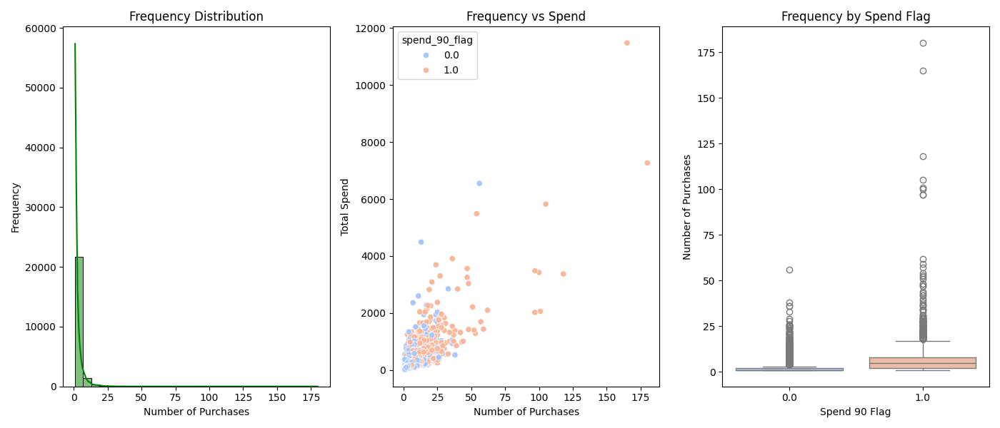

# Customer Lifetime Value & RFM Analysis using Machine Learning.

[CDNow Wikipedia](https://en.wikipedia.org/wiki/CDNow)

CDnow, Inc. was a dot-com company that operated an online shopping website selling compact discs and music-related products. In April 1998, during the dot-com bubble, the company was valued at over $1 billion ($1.74 billion in 2023). In July 2000, it was acquired by Bertelsmann Music Group for $117 million ($197 million in 2023); shortly thereafter Amazon was contracted to operate the website. At its peak, it employed over 750 people and had offices in Fort Washington, Pennsylvania, New York City, London, and Los Angeles.

In 2013 CDNow was completely taken offline.

[CDNow dataset](https://www.kaggle.com/datasets/woody123/cdnow-dataset)

[Customer LTV Notebook](src/notebooks/customer_ltv.ipynb)

## Business Value Analysis

### Recency Segmentation

#### Recency Distribution

* **High Recent Activity:** There are notable peaks around 0 to -50 days, indicating a large number of customers have made recent purchases. This suggests current promotional campaigns or product offerings are effectively engaging customers.
* **Loyal Customers:** The significant number of purchases made in the very recent past (around 0 days) indicates that a portion of the customer base is highly engaged and possibly loyal.
* **Potential Lapsed Customers:** The lower frequency of purchases around -200 to -300 days suggests there may be a segment of customers who have not engaged with the business for a while. This could be a target for re-engagement campaigns.

#### Recency vs Spend

* **Higher Spend with Recency:** This confirms that recent customer engagement is a strong predictor of higher spending. Maintaining consistent and relevant communication with customers is crucial to keeping them engaged and driving higher spending.
* **Engaged High Spenders:** The orange points (Recent spenders) clustered near the recent dates (0 days) highlight a segment of high-value customers who have been actively purchasing recently.
* **Retention Opportunity:** Customers with older purchase dates and lower spending might represent an opportunity for retention and up-selling. Strategies such as targeted marketing or personalized offers could help re-engage these customers.

#### Recency by Spend Flag

* **Targeting Non-Recent Customers:** Customers with a spend_90_flag of 0.0, who have not spent significantly recently, present an opportunity for targeted re-engagement strategies. Identifying the reasons for their reduced activity (e.g., product preferences, past purchase issues) could inform personalized approaches to bring them back.

* **Average Non-Recent Customers Days:** These customers have an average of about 1 year, this is consistent with the first graph distribution. Investigating what changed a year ago could provide an opportunity to identify the cause of the drop and prevent such a drop-off in the future.

#### Strategic Recommendations

1. **Engagement Campaigns for Recent Customers:** Leverage the high engagement of recent customers by offering loyalty programs, exclusive offers, and personalized recommendations to maintain their activity levels.
1. **Reactivation Campaigns:** Develop targeted marketing efforts for customers who have not made purchases recently (e.g., beyond -200 days). Use incentives such as discounts, special promotions, or personalized communications to re-engage them.
1. **High-Value Customer Focus:** Identify and focus on high-value customers (those with high spending and recent activity) to ensure they feel valued and continue to receive exceptional service and offers.

### Frequency Segmentation

#### Frequency Distribution

* **Skewed Distribution:** The distribution is heavily right-skewed, indicating that most customers make very few purchases. This is common in many businesses where a small number of customers contribute to the majority of the transactions.
* **Majority Low Frequency:** The majority of customers have made fewer than 10 purchases, suggesting that most customers are infrequent buyers.
* **Identifying High-Value Customers:** There is a small number of customers who have made a large number of purchases. These customers are likely very loyal and valuable to the business. They could be targeted for loyalty programs or premium services.

#### Frequency vs Spend

* **Positive Correlation:** There is a positive correlation between the number of purchases and total spending. Customers who buy more frequently tend to spend more overall.
* **High-Spend Outliers:** There are several outliers with both high frequency and high total spend, marked in orange. These customers are highly engaged and spend significantly, making them critical to business revenue.
* **High-Value Segmentation:** The orange points indicate that recent spenders are distributed across various purchase frequencies, though more frequent purchasers tend to spend more. This segmentation can help in creating targeted marketing campaigns for high-value customers.
* **High-Value Re-engagement:** The presence of blue points among high spenders suggests there are customers with high historical spending who have not engaged recently. These customers are prime targets for re-engagement campaigns to encourage them to resume purchasing.
